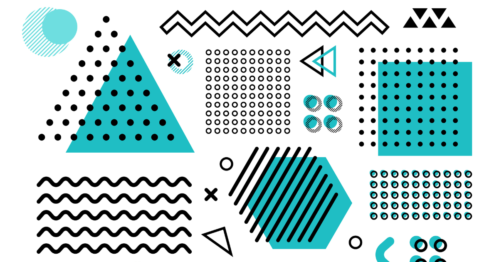

## Design Patterns?

In the realm of software development, design patterns act as guiding principles, offering a structured approach to solving common problems. When we discuss design patterns, we're essentially exploring the best ways to compose code—similar to how a chef blends ingredients for a delicious dish. In this context, let's dive into the world of Model-View-Controller (MVC), a practical approach that I've found immensely useful in my role as a front-end developer for our final project.

## MVC What?
Think of our software project as a well-organized kitchen. The MVC pattern, in this analogy, is like the recipe that breaks down tasks into manageable steps. Each role—Model, View, and Controller—takes on a specific responsibility, much like how different kitchen tools serve distinct purposes in the cooking process.

In my position as the front-end developer, I'm essentially the one responsible for the 'presentation' part of our project—the View in MVC. This is comparable to a chef meticulously plating a dish, ensuring it not only looks appealing but also functions well for those enjoying the meal.

As we implement MVC, the 'Model' becomes the recipe's ingredients and instructions—the data and logic behind the scenes. The 'Controller' acts as the chef overseeing the cooking process, making sure everything comes together seamlessly. Meanwhile, the 'View' is the final dish presented to the diners—the user interface that I, as a front-end developer, craft with tools like Bootstrap, React, and React Bootstrap.

## Reflection
Reflecting on our web application development, the application of the Model-View-Controller (MVC) design pattern went beyond the mere structuring of code—it evolved into a strategic and pragmatic approach that became integral to ensuring the success of our project. MVC, much like a seasoned chef's systematic methodology in the kitchen, provided a framework that enabled us to navigate the complexities of our codebase with clarity and purpose.

In the dance of web development, where every move must be intentional and coordinated, the combination of React and Bootstrap, orchestrated within the MVC paradigm, emerged as a powerful trio. React, with its component-based architecture, allowed for the modular construction of user interface elements, resembling the precision with which a chef selects and prepares individual ingredients. Bootstrap, acting as a reliable sous chef, contributed to the visual aesthetics and responsiveness of the UI, akin to enhancing the presentation of a culinary creation. Together, these technologies seamlessly integrated with MVC principles, resulting in user interfaces that were not only visually appealing but also functionally robust—a fusion of style and substance, much like ensuring a dish not only looks enticing but also delights the palate.

In essence, my journey with MVC transcended the realm of code architecture; it became a narrative of crafting a user-friendly and efficient tool. The steps of MVC—Model, View, Controller—were not just theoretical constructs but practical guidelines that informed our decision-making at every stage of development. It's akin to choreographing a dance where each movement contributes meaningfully to the overall performance. The 'Model' laid the foundation, the 'View' presented the final act, and the 'Controller' orchestrated the entire sequence—resulting in an application that resonates as more than just lines of code, but as an intuitively designed and seamlessly functioning solution for our users.

In the grand scheme of our web development journey, the incorporation of MVC principles wasn't just about adhering to industry best practices; it was about creating an experience for our users that mirrored the satisfaction derived from a well-prepared dish. Just as a chef crafts a memorable dining experience, our team, guided by the MVC dance, crafted a digital experience that goes beyond aesthetics, ensuring our application not only meets technical standards but also delights and serves its users effectively.