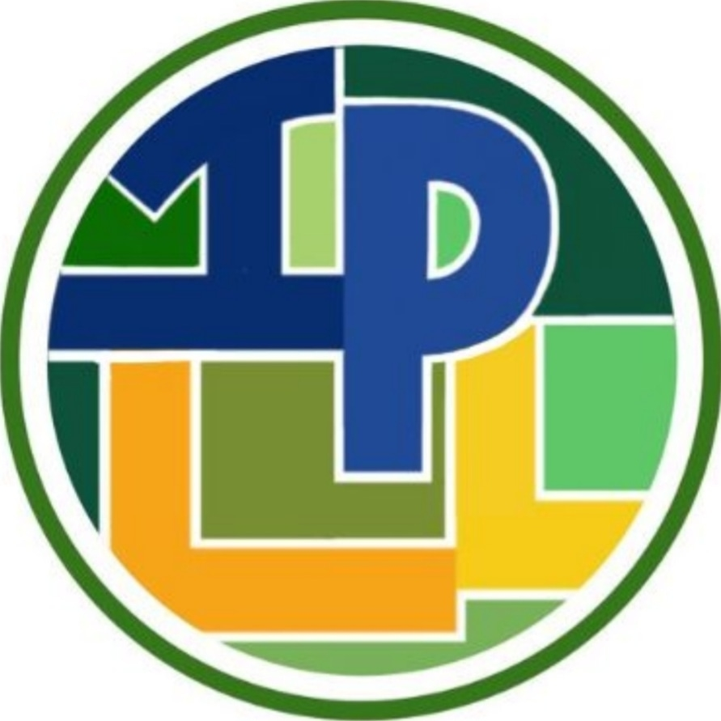
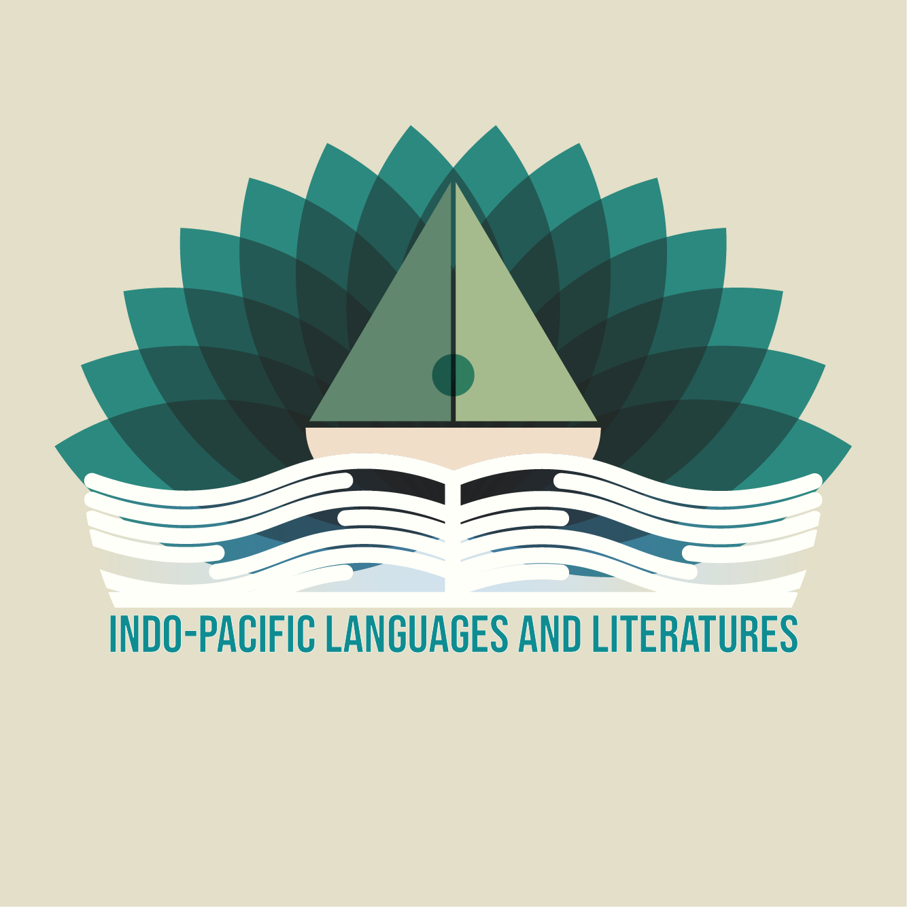

Since the previous logo looks a bit dated, I was given a task to create a new logo for the Department of Indo-Pacific Languages and Literatures. 

Here is the previous logo:

This is the logo I made:

The logo is composed of three parts: The flower, boat, and the wave. The 14 petals of the flower represent the 14 languages that the Indo-Pacific Languages and Literatures (IPLL) department of UH Manoa offers. Flowers signify many things, one of which is beauty. Therefore, there is nothing more fitting to represent IPLL languages than a flower. The ocean wave means two things. The first one is that the Indo-Pacific region is situated around the Pacific ocean, which is the largest among the five oceanic divisions in the world. Therefore, it is inevitable to include an ocean wave design to the logo. However, I designed the ocean waves to mimic a book to add even more significance to it. Apart from languages, our department also offers courses to different cultures and literatures from the Indo-Pacific region, hence, the IPLL department boasts massive wealth of knowledge just like the vastness of the Pacific. This leads us to the last component of the logo. Exploration brought a lot of things to humankind, the most significant one is knowledge. The boat signifies that aspect. By gaining the ability to travel through the seas, people started to gain more wisdom about the world. In the world of literature, however, understanding comes from being able to write, hence, I designed the boat to also represent a pen. All three components together represent the one-of-a-kind IPLL department of UH Manoa.

<!--You can learn more at the [UH Micromouse News Announcement](https://manoa.hawaii.edu/news/article.php?aId=2857). -->
