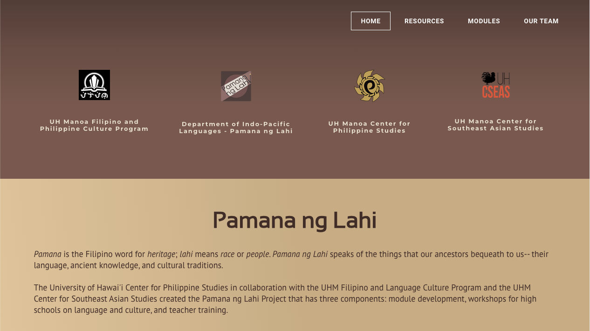
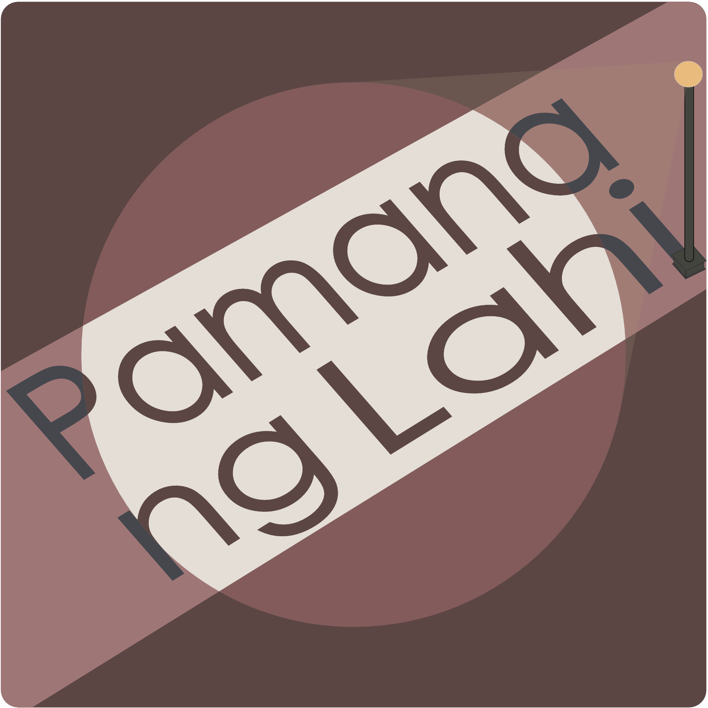

When I first started working at the Department of Indo-Pacific Languages and Literatures (IPLL) at UH Manoa, I redesigned the Pamana ng Lahi website and gave it a new look. I also updated the contents and made a new logo to match the purpose of the website. 
## My reflection
This was my first time working with Weebly and my initial thought was that it is very limiting and less intuitive to use compared to other website builders I have used. This prompted me to learn HTML and CSS so that I could build a website of my own liking in the future, or better yet, rebuild the Pamana ng Lahi Website.

### Pamana ng Lahi front page

### Logo

<!--You can learn more at the [UH Micromouse News Announcement](https://manoa.hawaii.edu/news/article.php?aId=2857). -->
