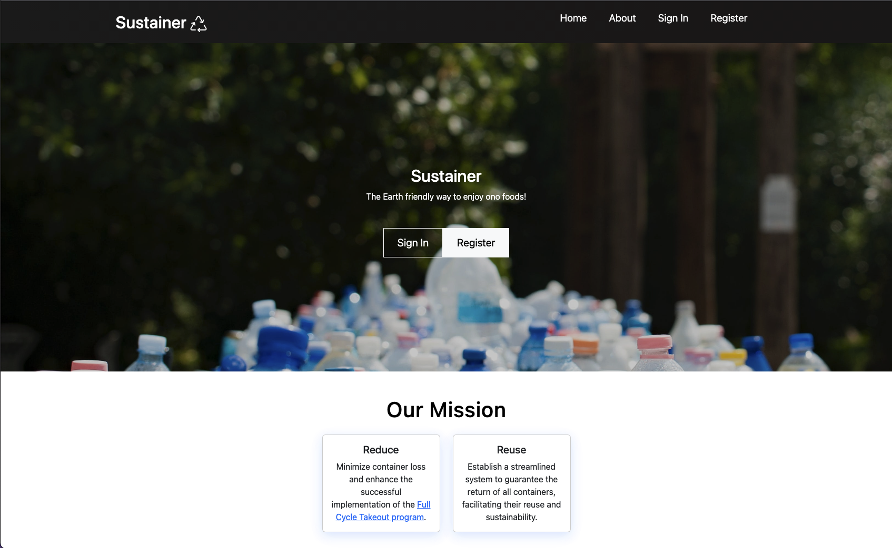

During the Hawaii Annual Code Challenge, I assumed the role of UI designer and front-end developer within my team in creating <a href="https://sus-tainer.github.io/" target="_blank">Sustainer</a>, our solution to Zero Waste Oahu's need of a reusable takeout program app. My primary responsibility was to ensure the optimal performance of our web application on mobile devices, necessitating the implementation of a mobile-first design approach while maintaining an aesthetically pleasing interface. While initially challenging, particularly in navigating the dual demands of mobile and desktop design and grappling with the intricacies of the CSS box model, my persistent dedication and ongoing learning efforts allowed me to triumph in my role.

As the lead front-end developer, my duties extended beyond manipulating Bootstrap and CSS. I collaborated with fellow team members to seamlessly integrate the features they were developing into the user interface. This collaborative approach facilitated effective communication, enabling us to collectively shape our application's visual and experiential aspects as we worked towards the shared objective of securing victory.

## Challenges and Resolution

We had a hard time with our schedules during the project because we all had different classes and work times. So, we could only meet twice a week. As a solution, we had to plan carefully to make the most of our time and be accountable for the work we contributed to the team.

Also, there was a big problem with our app, which sent new users to a blank page instead of the proper homepage after signing up. Even though I usually focused on the front end, I took on the challenge and worked on fixing this problem. Ultimately, I fixed it, showing how committed I was to the team's success and that I was ready to do more than just my usual job.

This experience helped me learn a lot and made me feel more confident as a programmer. I'm excited to join the Hawaii Annual Code Challenge again and participate in other hackathons. I'm ready to use the things I've learned and expand them to help with future projects and make a more meaningful contribution.
